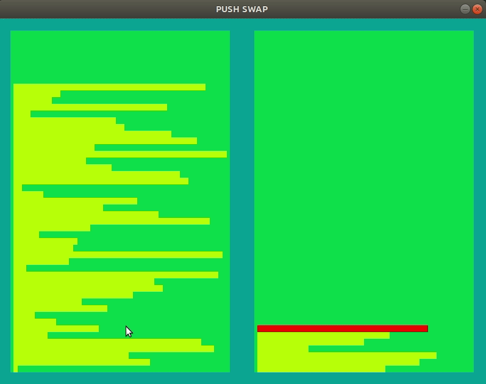

# 21-push_swap
Stack sort using another stack  
  
Allowed commands:  
pa : pop element from b stack and push it to a  
pb : pop element from a stack and push it to b  
sa : swap stack a top 2 elements  
sb : swap stack b top 2 elements  
ss : swap both stacks top 2 elements  
ra : rotate a stack forward  
rb : rotate b stack forward  
rr : rotate both stacks forward  
rra : rotate a stack backward  
rrb : rotate b stack backard  
rrr : rotate both stacks backward  
  
forward rotation moves stack top value to the bottom of the stack  
backward rotation moves stack bottom element on top of the stack  

Both checker and push_swap programs read stack elements from program's arguments.  
First arg will be on top of the stack a and b will be empty.  
  
push_swap program sorts stack a in ascending order(lowest value on top) and prints each executed command.  
checker program reads stdout and applies commands to the stacks.  
When reading is finished, checker prints the status of the stack : "OK" if a is sorted and b is empty, "KO" otherwise  
  
Checker flags:  
  -v for console visualization after each readed command execution  
  -gv for SDL2 graphics visualization  
    
  
